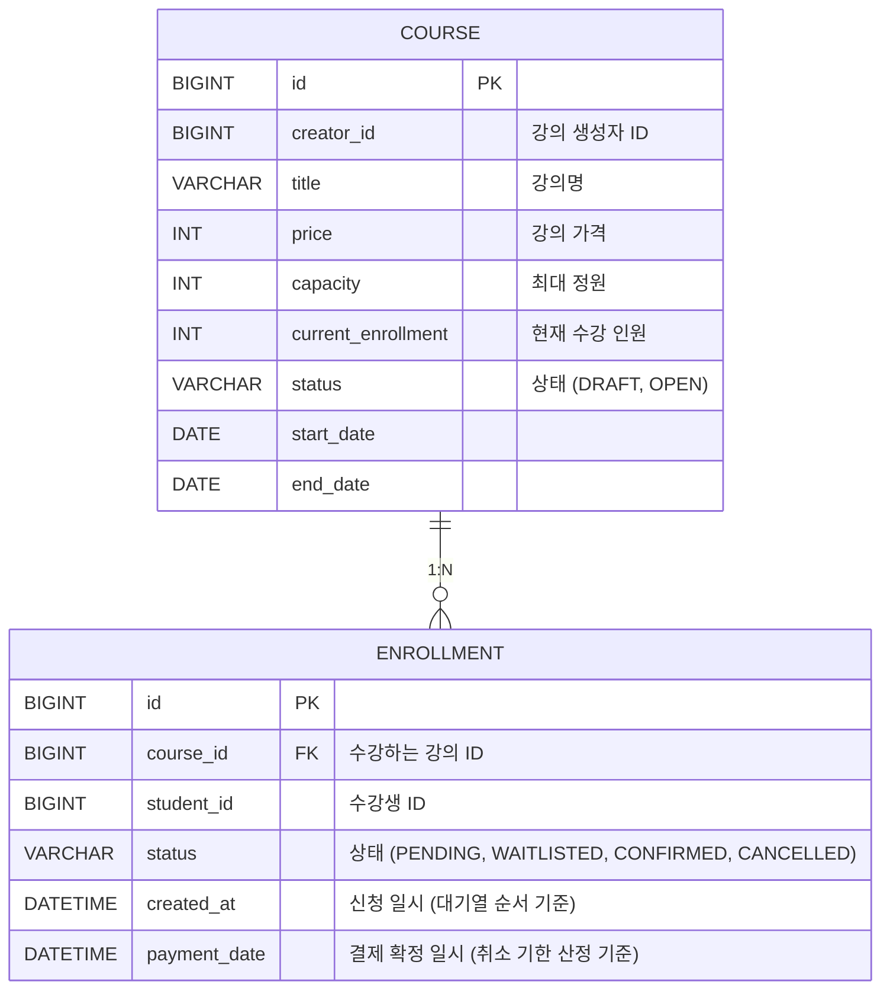

# 라이브 클래스 수강신청 시스템 (Live Class Enrollment System)
최적의 효율을 찾아내는 '집요함'을 가진 백엔드 개발자 조정원의 과제 전형 제출용 저장소입니다. 대규모 트래픽이 몰리는 수강신청 환경을 가정하고 **안전한 동시성 제어**와 **공정한 대기열 시스템**을 구현하는 데 집중했습니다.  
<br>
## 1. 프로젝트 개요
크리에이터가 클래스를 개설하고 수강생들이 선착순으로 수강신청을 할 수 있는 백엔드 API 서버입니다.
정원이 마감된 이후의 신청자는 자동으로 대기열로 전환되며, 기존 수강생의 취소 시 선입선출 방식으로 자동 승급되는 비즈니스 로직을 포함하고 있습니다.

<br>

## 2. 기술 스택
- **Language & Framework (Java 21 / Spring Boot 4.0.6)** <br>
  최신 자바 환경을 기반으로 안정적인 RESTful API 서버를 구축하기 위해 채택했습니다. Spring Web을 통해 클라이언트와 JSON 기반으로 원활하게 통신합니다.
- **Data Access (Spring Data JPA, Hibernate)** <br>
  객체 지향적인 도메인 설계(상태 전이 등)를 가능하게 하고, 특히 `Pessimistic Lock(비관적 락)`을 활용해 데이터베이스 레벨에서 안전하게 동시성을 제어하기 위해 채택했습니다.
- **Database (H2 In-memory)** <br>
  평가자가 복잡한 인프라 세팅 없이 코드를 다운로드한 즉시 로컬 환경에서 서버를 띄우고 테스트할 수 있도록 인메모리 DB를 선택했습니다.
- **Test (JUnit 5)** <br>
  대규모 동시성 부하 환경과 복잡한 비즈니스 로직(대기열 승급, 예외 처리 등)을 코드로 자동화하여, 시스템의 신뢰성을 완벽하게 검증하기 위해 사용했습니다.
- **Validation** <br>
  API 진입 단계에서 필수 파라미터 누락 등의 잘못된 요청을 사전에 차단하여 방어적 프로그래밍을 구현하기 위해 추가했습니다.
- **Lombok** <br>
  반복되는 코드(Getter, 생성자 등)를 최소화하여 핵심 비즈니스 로직 자체의 가독성에 집중할 수 있도록 구성했습니다.

<br>

## 3. 실행 방법
프로젝트 루트 디렉터리에서 아래 명령어를 통해 서버를 실행할 수 있습니다. 
```bash
# Windows
gradlew bootRun 또는 ./gradlew bootRun 

# Mac / Linux
./gradlew bootRun
```
- 서버는 기본적으로 `http://localhost:8080`에서 실행됩니다.

<br>

## 4. 요구사항 해석 및 가정
과제의 핵심 목표를 달성하기 위해 다음과 같은 가정을 바탕을 설계했습니다.
- **사용자 인증** : 별도의 로그인 구현 대신, API Gateway등에서 인증을 마쳤다고 가정하고 HTTP Header(X-User-Id)를 통해 사용자 식별자를 받습니다.
- **수강 취소 기한** : 무분별한 취소와 결제 시스템의 혼선을 막기 위해 '결제 확정 후 7일 이내'에만 취소할 수 있도록 정책을 설정했습니다.
- **대기열 처리** : 별도의 Queue 시스템(Redis)를 도입하기보다, RDBMS의 **created_at** 타임스탬프를 활용해 RDBMS 내부에서 상태 기반으로 대기열을 해결하도록 단순화했습니다.

<br>

## 5. 설계 결정과 이유
### 비관적 락(Pessimistic Lock)을 통한 동시성 제어
- 문제 : 남은 자리가 1개일 때, 수백 명이 동시에 신청하면 **Lost Update** 현상으로 정원이 초과될 수 있습니다.
- 해결 : `CourseRepository` 조회 시 `@Lock(LockModeType.PESSIMISTIC_WRITE)`를 적용했습니다.
- 이유 : 수강신청은 충돌 발생 확률이 극도로 높은 환경입니다. 낙관적 락(Optimistic Lock)사용 시 충돌로 인한 잦은 재시도(Retry)가 발생하여 오히려 DB 커넥션 풀을 고갈시킬 우려가 있다고 판단하여 DB 레벨에서 확실하게 Lock을 쥐는 비관적 락을 선택했습니다.

### 상태 전이 기반의 수강(Enrollment) 생명주기 관리
- 수강 데이터의 상태를 `PENDING(결제대기)`, `CONFIRMED(확정)`, `CANCELLED(취소)`, `WAITLISTED(대기열)` 4가지로 명확히 분리하여 복잡한 비즈니스 로직을 상태 전이 조건만으로 깔끔하게 제어할 수 있도록 객체 지향적으로 설계했습니다.

<br>

## 6. 미구현 / 제약사항
- **로그인 구현** : 별도의 로그인 구현은 하지 않고 HTTP Header(X-User-Id)를 통해 사용자 식별자를 받도록 처리했습니다.
- **외부 결제 시스템 연동** : 실제 PG사 연동 모듈은 구현되지 않았으며 `confirm` API 호출 시 내부 상태만 변경되도록 Mocking 처리했습니다.

<br>

## 7. AI 활용 범위 
본 프로젝트는 생산성 향상을 위해 AI와 협력하는 프로그래밍 방식으로 진행되었습니다.
- 도움받은 부분 : JUnit 5 기반의 테스트 환경 설정, Postman 테스트 시나리오 기획, Test 코드 작성

<br>

## 8. API 목록 및 예시
모든 API는 사용자 인증이 완료되었다고 가정하며, HTTP Header 'X-User-Id'를 통해 식별자를 전달받습니다.

### 표정리
| Domain | Method | URL | Description | Auth Header |
|---|---|---|---|---|
| **Course** | `POST` | `/api/courses` | 신규 강의 생성 | `X-User-Id: {creatorId}` |
| | `PATCH` | `/api/courses/{id}/open` | 강의 모집 시작 | `X-User-Id: {creatorId}` |
| **Enrollment** | `POST` | `/api/courses/{id}/enrollments` | 수강 신청 (정원 초과시 대기열) | `X-User-Id: {studentId}` |
| | `PATCH` | `/api/enrollments/{id}/confirm` | 수강 결제 확정 | `X-User-Id: {studentId}` |
| | `PATCH` | `/api/enrollments/{id}/cancel` | 수강 취소 (대기열 자동 승급) | `X-User-Id: {studentId}` |
| | `GET` | `/api/enrollments/me` | 내 수강 신청 목록 조회 | `X-User-Id: {studentId}` |

### Course (강의 도메인)
#### 1. 신규 강의 생성
- **Method & URL:** `POST /api/courses`
- **Header:** `X-User-Id: {creatorId}` (예: `X-User-Id: 1`)
- **Description:** 새로운 라이브 클래스를 `DRAFT` 상태로 생성합니다.
- **Request Body:**
```json
{
  "title": "JPA 락을 활용한 수강신청 구현",
  "description": "백엔드 동시성 제어 실무",
  "price": 50000,
  "capacity": 300,
  "startDate": "2026-06-01",
  "endDate": "2026-06-30"
}
```

#### 2. 강의 모집 시작 (상태 변경)
- **Method & URL:** `PATCH /api/courses/{id}/open`
- **Header:** `X-User-Id: {creatorId}`
- **Description:** 강의 상태를 `DRAFT`에서 `OPEN`으로 변경하여 수강 신청을 받을 수 있도록 활성화합니다. 작성자 본인만 변경할 수 있습니다.

<br>

### Enrollment (수강신청 도메인)
#### 3. 수강 신청 (선착순 및 대기열)
- **Method & URL:** `POST /api/courses/{id}/enrollments`
- **Header:** `X-User-Id: {studentId}` (예: `X-User-Id: 102`)
- **Description:** 특정 강의에 수강 신청을 합니다. 정원이 남아있으면 `PENDING(결제대기)`, 초과되었으면 자동으로 `WAITLISTED(대기열)` 상태로 저장됩니다.
- Response (Success - 200 OK): 수강 신청 고유 ID 반환
```json
15
```

#### 4. 수강 결제 확정
- **Method & URL:** `PATCH /api/enrollments/{id}/confirm`
- **Header:** `X-User-Id: {studentId}`
- **Description:** `PENDING` 상태인 수강 내역의 결제를 확정하여 `CONFIRMED` 상태로 변경하고 결제 일시(paymentDate)를 기록합니다.

#### 5. 수강 취소 및 대기자 승급
- **Method & URL:** `PATCH /api/enrollments/{id}/cancel`
- **Header:** `X-User-Id: {studentId}`
- **Description:** 수강을 취소(`CANCELLED`)합니다. 결제 확정일로부터 7일이 지난 경우 취소가 제한됩니다. 정원 내 인원이 취소한 경우, 대기열(`WAITLISTED`)의 가장 앞선 1명이 `PENDING`으로 자동 승급됩니다.

#### 6. 내 수강 신청 목록 조회(페이지네이션 적용)
- **Method & URL:** `GET /api/enrollments/me?page=0&size=10`
- **Header:** `X-User-Id: {studentId}`
- **Description:** 로그인한 사용자의 전체 수강 신청 내역을 페이징 처리하여 최신순으로 조회합니다.
- **Response (Success - 200 OK):**
```json
{
  "content": [
    {
      "enrollmentId": 2,
      "courseId": 11,
      "status": "CONFIRMED",
      "createdAt": "2026-05-21T18:27:45.195",
      "paymentDate": "2026-05-21T18:30:10.000"
    },
    {
      "enrollmentId": 5,
      "courseId": 12,
      "status": "WAITLISTED",
      "createdAt": "2026-05-22T09:10:00.000",
      "paymentDate": null
    }
  ],
  "pageable": {
    "pageNumber": 0,
    "pageSize": 10
  },
  "totalElements": 2
}
```

<br>

## 9. 데이터 모델 설명 (ERD & 스키마)
본 프로젝트는 핵심 비즈니스 로직과 동시성 제어를 처리하기 위해 2개의 메인 테이블을 설계했습니다.
### ERD (Entity Relationship Diagram)

### 테이블 스키마 상세
### Course (강의 테이블)
동시성 제어의 핵심이 되는 테이블입니다. 정원 초과를 방어하기 위해 신청시 비관적 락이 걸리는 주체입니다. 
| 컬럼명 | 타입 | 제약조건 | 설명 |
|---|---|---|---|
| `id` | BIGINT | PK, AUTO_INCREMENT | 강의 고유 식별자 |
| `creator_id` | BIGINT | NOT NULL | 강의를 개설한 크리에이터 식별자 |
| `title` | VARCHAR | NOT NULL | 강의 제목 |
| `price` | INT | NOT NULL | 수강료 |
| `capacity` | INT | NOT NULL | 수강 가능한 최대 정원 |
| `current_enrollment`| INT | NOT NULL, DEFAULT 0 | 현재 수강 확정 및 대기 상태인 총 인원 |
| `status` | VARCHAR | NOT NULL | 강의 상태 (`DRAFT`, `OPEN`) |

### Enrollment (수강 신청 테이블)
강의와 학생의 다대다 (N:M) 관계를 풀어내는 매핑 테이블이자, 대기열 및 결제 상태 전이 로직을 담당합니다. 
| 컬럼명 | 타입 | 제약조건 | 설명 |
|---|---|---|---|
| `id` | BIGINT | PK, AUTO_INCREMENT | 수강 신청 고유 식별자 |
| `course_id` | BIGINT | FK, NOT NULL | 수강 신청한 강의 식별자 |
| `student_id` | BIGINT | NOT NULL | 수강 신청한 학생 식별자 |
| `status` | VARCHAR | NOT NULL | 수강 상태 (`PENDING`, `WAITLISTED`, `CONFIRMED`, `CANCELLED`) |
| `created_at` | DATETIME | NOT NULL | 신청 일시. 대기열(Waitlist) 승급 시 선입선출(FIFO)의 절대적 기준 |
| `payment_date` | DATETIME | NULLABLE | 결제 확정 일시. 취소 가능 기한(7일 이내)을 산정하는 기준 |

<br>

## 10. 테스트 실행 방법
핵심 비즈니스 로직과 동시성 제어를 검증하기 위한 단위/통합 테스트가 작성되어 있습니다. 
전체 테스트를 한 번에 실행하거나, 도메인/목적별로 개별 실행하여 검증할 수 있습니다. 특히 `EnrollmentConcurrencyTest`는 100명의 스레드가 동시에 수강신청을 요청할 때 정원이 정확히 제어되는지 검증합니다.
```bash
# 1. 전체 테스트 실행
./gradlew test

# 2. 강의(Course) 도메인 기본 비즈니스 로직 및 권한 테스트 
./gradlew test --tests "com.liveclass.classenrollmentsystem.CourseBasicTest"

# 3. 수강신청(Enrollment) 도메인 상태 전이 및 대기열 승급 테스트
./gradlew test --tests "com.liveclass.classenrollmentsystem.EnrollmentBasicTest"

# 4. 대규모 트래픽 동시성 제어(Pessimistic Lock) 방어 테스트
./gradlew test --tests "com.liveclass.classenrollmentsystem.EnrollmentConcurrencyTest"
```

### 수행한 Test 방식
#### 1. 자동화 테스트 (JUnit 5 & Spring Boot Test)
- **비즈니스 흐름 검증(`@SpringBootTest`, `@Transactional`)**
  강의 생성부터 수강 신청, 결제 확정, 취소 시 대기열 승급, 7일 경과 후 취소 불가 예외 처리 등 전체 비즈니스 생명주기와 엣지 케이스를 코드로 자동화하여 검증했습니다.
- **동시성 부하 테스트 (`ExecutorService`, `CountDownLatch`)**
  실제 수강신청 오픈 시점의 대규모 트래픽을 재현하기 위해 100개의 멀티 스레드를 생성하여 테스트를 진행했습니다. 이를 통해 비관적 락(Pessimistic Lock)이 `Lost Update` 현상을 완벽하게 방어하고 초과 인원 발생을 막아내는 것을 코드로 증명했습니다.

#### 2. API 엔드포인트 테스트 (Postman)
- **클라이언트 연동 시나리오 검증**
  클라이언트(프론트엔드) 관점에서 API가 예상대로 동작하는지 확인하기 위해 Postman을 활용했습니다.
- `X-User-Id` 헤더를 다양하게 조작해가며 권한 검증(작성자만 강의 오픈 가능 등)을 테스트하고, JSON 요청/응답 구조 및 페이징 처리가 명세에 맞게 잘 반환되는지 확인했습니다.

#### 3. 데이터 상태 및 트랜잭션 추적 (H2 Console)
- **데이터 무결성 크로스체크**
  메모리 데이터베이스(H2) 콘솔에 직접 접속하여, API 호출 및 상태 변경 시 `COURSE`와 `ENROLLMENT` 테이블의 레코드가 의도대로 반영되는지 확인했습니다.
- 특히 대기열 전환 및 승급 로직에서 타임스탬프(`created_at`)와 상태 전이(`status`)가 정확히 업데이트되는지 눈으로 직접 추적하며 데이터의 정합성을 보장했습니다.
  

